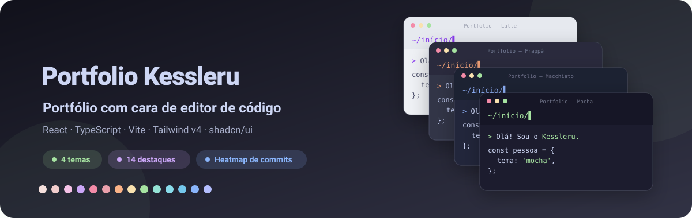
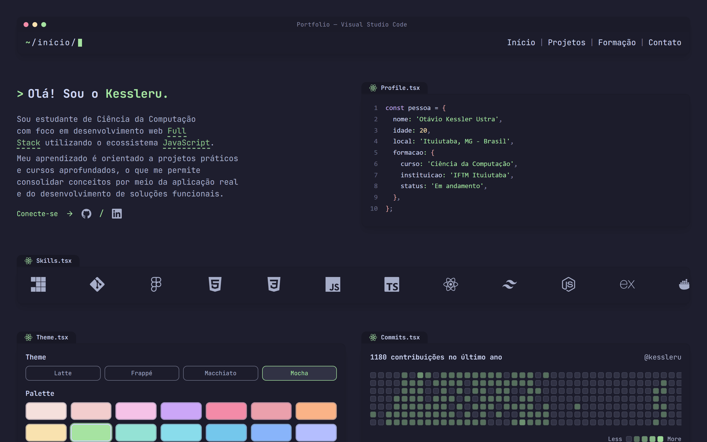
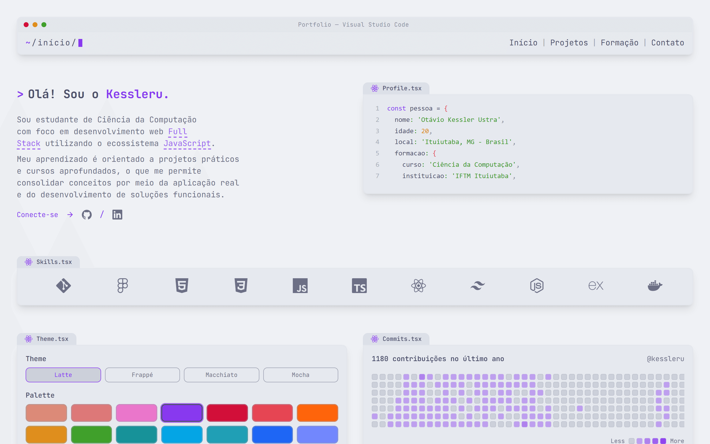
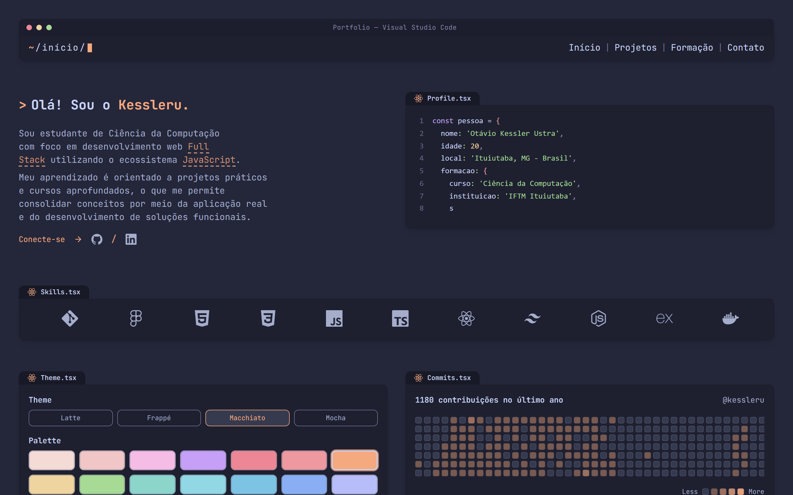
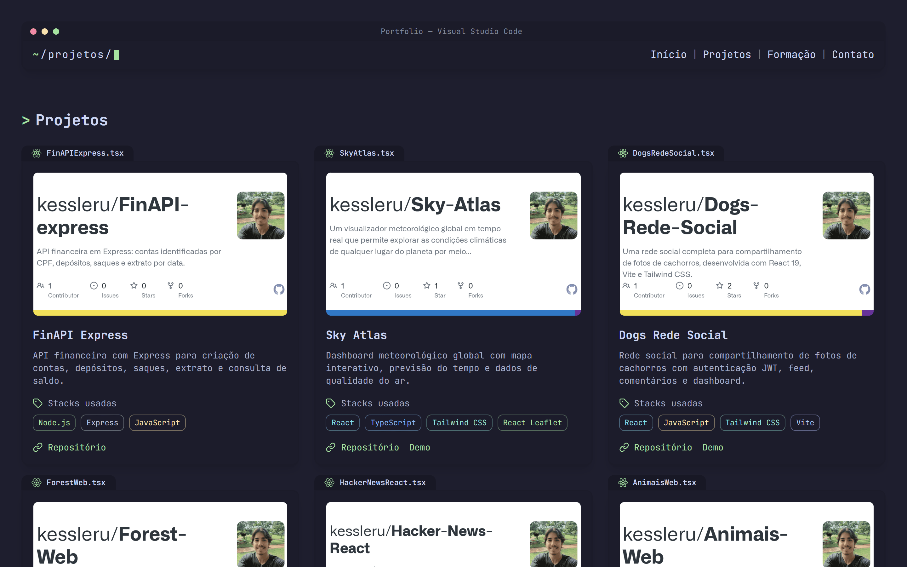
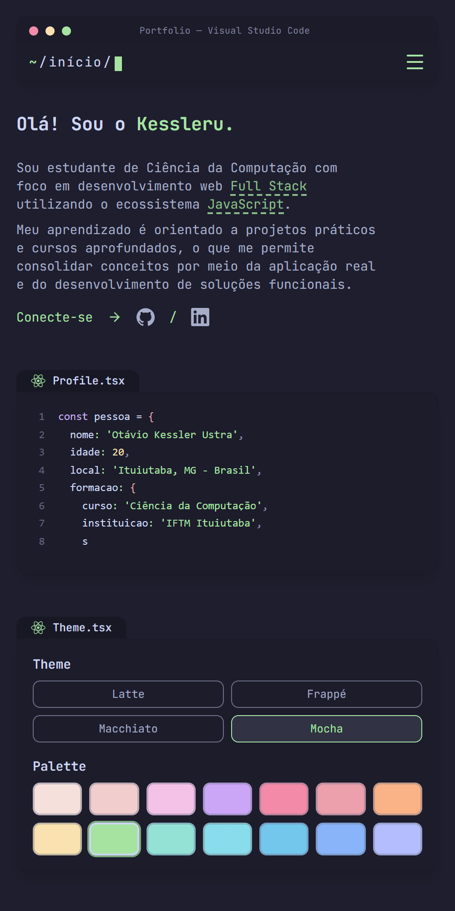

<div align="center">



**Meu portfólio pessoal, desenhado como uma janela de editor de código: quatro temas Catppuccin, 14 cores de destaque, heatmap de commits e vitrine de projetos.**

[](https://portfolio-kessleru.vercel.app)
[](package.json)
[](https://github.com/kessleru/Portfolio-kessleru/commits/main)

<p><b><a href="https://portfolio-kessleru.vercel.app">→ Abrir o portfólio</a></b></p>



</div>

> **Nota:** o portfólio está em construção — as páginas **Formação** e **Contato** ainda mostram um
> aviso de "em construção".

## Sobre

O site inteiro imita uma janela de editor: barra com os três botões, o caminho da página atual
(`~/início/`, `~/projetos/`) com cursor piscando, e cada bloco com uma aba de arquivo (`Profile.tsx`,
`Skills.tsx`, `Commits.tsx`). As cores vêm da paleta [Catppuccin](https://catppuccin.com): quem visita
escolhe um dos quatro sabores e uma das 14 cores de destaque, e a escolha fica salva no navegador.

## Telas

### Temas

O mesmo início nos sabores **Latte** (destaque *mauve*) e **Macchiato** (destaque *peach*). O tema
troca o atributo `data-theme` no `<html>` e o destaque troca a variável `--ctp-accent`; todo o
resto é Tailwind lendo essas variáveis.

<table>
<tr>
<td width="50%"></td>
<td width="50%"></td>
</tr>
<tr>
<td align="center"><sub><b>Latte</b></sub></td>
<td align="center"><sub><b>Macchiato</b></sub></td>
</tr>
</table>

### Projetos

Cada card usa a imagem de *Open Graph* que o próprio GitHub gera para o repositório, com as tags de
stack e links para o código e a demo.



### Celular

<table>
<tr>
<td width="50%"></td>
<td width="50%">

No celular o menu vira um botão que abre a navegação e fecha ao escolher uma página.

</td>
</tr>
</table>

## Funcionalidades

| | |
|---|---|
| 🎨 **4 temas × 14 destaques** | Latte, Frappé, Macchiato e Mocha; escolha salva no `localStorage` |
| 🟩 **Heatmap de commits** | Contribuições do último ano via [github-contributions-api](https://github.com/grubersjoe/github-contributions-api), com cache de 24 horas |
| 🗂️ **Vitrine de projetos** | 10 repositórios com imagem de Open Graph do GitHub, stack e links |
| ⌨️ **Efeito de digitação** | O `Profile.tsx` é "digitado" na tela (componente `TextType`, do [React Bits](https://reactbits.dev)) |
| 🔁 **Faixa de skills** | Logos das tecnologias em loop contínuo (`LogoLoop`, também do React Bits) |
| 🧭 **Rotas reais** | `/`, `/projects`, `/training`, `/contact` e página 404 |
| 📈 **Analytics** | [Vercel Analytics](https://vercel.com/analytics) |

## Stack

| Camada | Ferramenta |
|---|---|
| UI | [React 19](https://react.dev) + [TypeScript](https://www.typescriptlang.org) |
| Build | [Vite](https://vite.dev) |
| Estilo | [Tailwind CSS v4](https://tailwindcss.com), [shadcn/ui](https://ui.shadcn.com) e a paleta [Catppuccin](https://catppuccin.com) |
| Rotas | [React Router](https://reactrouter.com) |
| Animação | [GSAP](https://gsap.com) (cursor do `TextType`) |
| Ícones | [Lucide](https://lucide.dev) e [React Icons](https://react-icons.github.io/react-icons/) |
| Deploy | [Vercel](https://vercel.com) |

## Rodando localmente

```bash
git clone https://github.com/kessleru/Portfolio-kessleru.git
cd Portfolio-kessleru
pnpm install
pnpm dev
```

O Vite sobe em `http://localhost:5173`. O heatmap e as imagens dos projetos precisam de internet.

### Scripts

| Comando | O que faz |
|---|---|
| `pnpm dev` | Servidor de desenvolvimento |
| `pnpm build` | `tsc -b` + build de produção em `dist/` |
| `pnpm preview` | Serve o build em `http://localhost:4173` |
| `pnpm lint` | ESLint — hoje acusa 1 erro (`react-refresh/only-export-components` em `ThemeProvider.tsx`) |

## Estrutura

```
src/
├── App.tsx                  # ThemeProvider + rotas + Header/Footer
├── pages/                   # Home, Projects, Training, Contact, 404
├── components/
│   ├── layout/              # Header (janela do editor) e Footer
│   ├── theme/               # ThemeProvider: sabor + destaque no localStorage
│   ├── ui/                  # ProfileCard, SkillsLoop, CommitHeatmapCard, ThemeSwitcher, Cards…
│   └── react-bits/          # LogoLoop e TextType
└── styles/index.css         # tokens do Catppuccin (4 sabores) e @theme do Tailwind
```

O [`vercel.json`](vercel.json) reescreve toda rota sem extensão para o `index.html`, para que
recarregar `/projects` não dê 404.

<details>
<summary><b>Regerando as imagens deste README</b></summary>

```bash
node .github/readme/gerar.mjs                 # banner.svg

pnpm build && pnpm preview                    # em outro terminal
pnpm add -D puppeteer-core sharp              # desfaça depois com git restore
node .github/readme/capturar.mjs              # telas em 2x, cada uma num tema
```

</details>

---

<div align="center">
<sub>Feito por <a href="https://github.com/kessleru">Otávio Kessler Ustra</a></sub>
</div>
